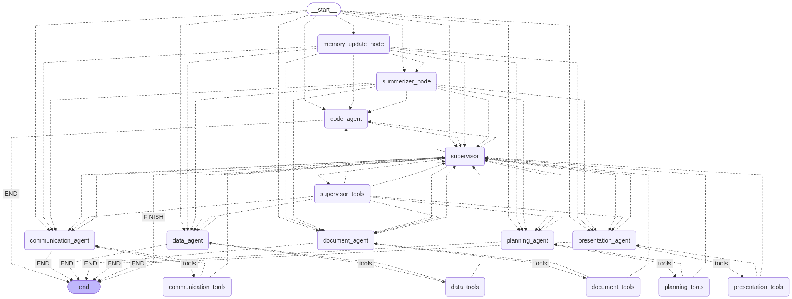
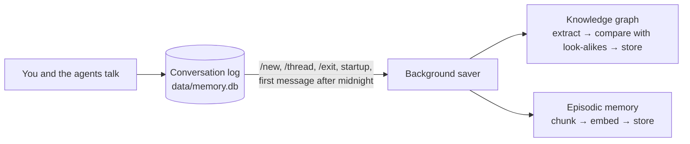

<h1 align="center">Switchboard</h1>

<p align="center">
  <strong>A stateful multi-agent assistant for Google Workspace, with long-term graph memory</strong>
</p>

<p align="center">
  LangGraph supervisor + 6 specialist agents · ~100 Workspace tools · Kùzu knowledge graph · Qdrant episodic memory · Human-in-the-loop email sends
</p>

<p align="center">
  <a href="https://python.org"></a>
  <a href="https://github.com/Yadeesht/Personal-Assistant-Agent"></a>
  
</p>

A personal assistant you talk to in the terminal. A supervisor agent hands each request to specialist agents for Gmail, Calendar and Tasks, Drive and Docs, Sheets and Forms, and Slides. They work on your real Google account.

It also builds a memory over time:
- what it learns about you goes into a **knowledge graph** it uses on every message;
- it follows **standing rules** you give it;
- it can **look up past conversations** when you ask;
- it **never sends an email without your yes**.

---

## Contents

1. [Setup](#1-setup)
2. [What you can do](#2-what-you-can-do)
3. [Features that grow with use](#3-features-that-grow-with-use)
4. [How it works](#4-how-it-works)
5. [The memory layer in detail](#5-the-memory-layer-in-detail)
6. [Configuration](#6-configuration)
7. [Project structure](#7-project-structure)
8. [Tests](#8-tests)
9. [Troubleshooting](#9-troubleshooting)

---

## 1) Setup

### What you need

| | |
|---|---|
| **Python** | 3.11 or newer (developed on 3.13) |
| **A language model** | An Azure OpenAI deployment of a chat model that supports tool calling (e.g. `gpt-4.1-mini`) |
| **Google** | A Google Cloud project with an OAuth client (step 3) |
| **Web search** *(optional)* | A Google Programmable Search Engine API key and engine ID |

### Step 1: Get the code and install

Windows (PowerShell):

```powershell
git clone https://github.com/Yadeesht/Personal-Assistant-Agent.git
cd Personal-Assistant-Agent

python -m venv .venv
.\.venv\Scripts\Activate.ps1

pip install -r requirements.txt --extra-index-url https://download.pytorch.org/whl/cpu
```

On macOS or Linux, activate with `source .venv/bin/activate`; the rest is the same.

> `requirements.txt` pins the CPU build of PyTorch (`torch==2.10.0+cpu`), which is only on PyTorch's own package index. That is why the `--extra-index-url` is needed. CPU builds with that name don't exist for macOS, so on a Mac change the line to `torch==2.10.0`.

### Step 2: Fill in `.env`

```powershell
Copy-Item .env.example .env      # macOS/Linux: cp .env.example .env
```

| Variable | What to put |
|---|---|
| `AZURE_AI_ENDPOINT` | The resource address only, e.g. `https://<resource>.cognitiveservices.azure.com/`. A full `.../openai/deployments/...` URL is cut back to this, with a warning. |
| `AZURE_AI_CREDENTIAL` | Your Azure OpenAI key |
| `AZURE_API_VERSION` | `2024-12-01-preview` (the default) |
| `MODEL_NAME` | Your **deployment** name |
| `GOOGLE_PSE_API_KEY`, `GOOGLE_PSE_ENGINE_ID` | For web search. Without them, everything else still works. |
| `DEFAULT_THREAD_ID` | The chat that opens at startup. The app updates it itself when you use `/new` or `/thread`. |
| `MODEL_TEMPERATURE`, `MODEL_TOOL_REASONING_EFFORT` | Only for reasoning models that need them. `gpt-6-luna` needs `1` and `none`. Leave them out for `gpt-4.1-mini`. |
| `MEMORY_RECALL` | `false` keeps memory and standing instructions out of the prompts (useful for evals). Default `true`. |

`.env` is git-ignored; never commit it.

### Step 3: Connect your Google account

1. In the [Google Cloud Console](https://console.cloud.google.com/), create a project and enable the **Gmail, Google Calendar, Google Tasks, Google Drive, Google Docs, Google Sheets, Google Slides** and **Google Forms** APIs.
2. Set up the **OAuth consent screen** (External, in testing) and add your Google account as a **test user**.
3. Create an **OAuth client ID** of type **Desktop app**, download its JSON, and save it as `app_tools/cred/setup_cred.json`.

The first time each app is used, a browser window opens so you can sign in. The token is then saved in `app_tools/cred/`, one file per app (`gmail_token.json`, `calendar_token.json`, `gtask_token.json`, `gdrive_token.json`, `gdocs_token.json`, `gsheet_token.json`, `gform_token.json`, `gslide_token.json`). The `cred/` folder is git-ignored.

### Step 4: Embedding models (automatic)

Memory uses two small embedding models that run locally:

| Folder | Model | Used for |
|---|---|---|
| `models/bge-small` | `BAAI/bge-small-en-v1.5` | Searching the knowledge graph |
| `models/gte-base` | `gte-modernbert-base` (from `unsloth/gte-modernbert-base`) | Searching past conversations |

They are downloaded from Hugging Face the first time they are needed and saved in those folders. After that they load offline. `models/` is git-ignored.

### Step 5: Run

```powershell
python main.py
```

At startup the app:
1. opens the chat named in `DEFAULT_THREAD_ID`;
2. saves anything an earlier session left out of memory;
3. starts loading the memory model in the background.

Then type a message, or `/` to see the commands.

### Optional: make it yours

It is set up for its author: it calls itself **JARVIS**, calls you **SIR**, and stores you in memory as **"Yadeesh"**. To use it as yourself, change that name in:
- `config/prompts.py`;
- `PROFILE_ENTITY` and the two "told directly by" lines in `app_tools/tools/rag_tools.py`;
- `KG_ACTOR_LABELS` in `core/agent.py`.

Do it before your first chat, so the memory is built around your name.

---

## 2) What you can do

### Run your Google apps from one chat

Say what you want in plain words. The supervisor picks the agent; you never choose one.

| App | Agent | What you can ask for |
|---|---|---|
| **Gmail** | communication | Unread mail, search, read and open emails, drafts, sending. Labels, filters and folders. Archive and restore, trash, mark as read. |
| **Calendar** | planning | Your calendars. Find, create, change and delete events, including attendees. |
| **Tasks** | planning | Task lists and tasks: create, update, move, complete, clear completed. |
| **Drive** | document | Search files, read their content, list folders, create and update files, check who has access and whether a file is public. |
| **Docs** | document | Find, read and create docs. Edit text, find and replace, tables, images, headers and footers. Inspect a doc's structure, export to PDF, read and reply to comments. |
| **Sheets** | data | List and create spreadsheets and sheets. Read and write ranges, formatting, conditional formatting, comments. |
| **Forms** | data | Create forms, change publish settings, read responses. |
| **Slides** | presentation | Create decks, read them, make batch edits, get page thumbnails, comments. |

Things to try:

- *"What unread emails did I get today?"*
- *"Schedule a 1-hour 'Q1 Planning' meeting tomorrow at 2 PM and invite Alice and Bob."*
- *"Add 'renew passport' to my tasks for Friday."*
- *"Create a doc called Weekly Notes with headings for priorities, blockers and actions."*
- *"Read my 'Budget' sheet and tell me which month went over."*

**Requests that span apps work too.** For example: *"Find the date and venue in the 'Offsite plan' doc and email them to the team."* The supervisor passes one agent's results to the next.

Along the way:

- **It looks before it asks.** If an agent is missing a detail, such as someone's email address or which file you meant, the supervisor first checks your other apps. It asks you only if none of them has it, or if it found two matches and needs you to pick.
- **It checks for newer news.** Before sending facts from a doc or sheet to other people, it checks whether newer emails changed them. If they conflict, it shows you both versions and asks which to use.
- **It is careful with addresses.** It uses an email address only if you gave it, or if it clearly belongs to that person: the From address of their email, or what memory knows about them. It never uses your own address just because a contact shares your name.
- **It reports what really happened.** It says plainly what could not be done, and never claims an action an agent didn't confirm.

### Emails go out only after your yes

Whenever an agent wants to send an email, the app pauses and shows you the **recipient, subject and full message**:
- **To send:** type `yes`, or `send`, `ok`, `approve`, `go ahead`.
- **Anything else cancels it** and goes to the agent as feedback. For example, reply *"make it shorter and add a thank-you"*; the revised email is shown to you again.
- **This is enforced in code** (`core/confirm.py`), so a prompt can't skip it.
- **A pending email survives a restart.** It is shown again when you reopen that chat.
- **More tools can be gated** by adding them to `CONFIRM_BEFORE_TOOLS` in `config/settings.py`. Calendar invites are a good candidate.

### Search the web

With the search keys in `.env`, the supervisor can search the public web directly, or within specific sites, and answer from the results.

### Chats and commands

Typing `/` pops up the commands with what each does. Tab or the arrow keys pick one.

| Command | What it does |
|---|---|
| `/new` | Save this chat to memory and start a fresh one (it also reloads the prompts) |
| `/thread` | Show the current chat's id; `/thread <id>` switches to another chat |
| `/reload` | Re-read `config/prompts.py` without restarting |
| `/clear` | Clear the screen |
| `/help` | List the commands |
| `/exit` | Save this chat to memory and quit (`exit`, `quit` and `bye` work too) |

- **Chats are kept.** Each chat is a thread stored in `data/checkpoints.db`. `/thread <id>` takes you back to an old one, exactly where you left off.
- **Ctrl+C at the input line works like `/exit`.** Pressed while the assistant is busy, it quits at once without the memory save. Whatever wasn't saved is saved at the next startup.
- **One failing message doesn't end the session.** You see the error and can keep chatting.

---

## 3) Features that grow with use

These pay off over days of use, so they are worth spending time with.

### It learns about you (knowledge graph)

- **It learns when a chat ends.** On `/new`, `/thread`, `/exit` or the next startup, the conversation is read in the background. Durable facts are stored as a graph: people, projects, organizations, tools, goals, preferences and how they connect.
- **Every agent sees it on every message:**
  - **your profile:** you, plus up to 12 of your most recent direct connections;
  - **related facts:** facts about what you just said, meaning the things you name plus things close in meaning, and how they connect.
- **Store something right away:** *"Remember that Priya is my project mentor; her email is priya@example.com."*
- **Ask what it knows:** *"What do you know about my internship?"*
- **See it:** a picture of the graph is redrawn after every save, at `docs/images/knowledge_graph.png`. It shows your personal facts, so it is kept out of git.
- **What you say now wins.** Memory can be out of date, so the current conversation and your apps take priority, and between two stored facts the newer one wins.

**Try it:** over a few chats, tell it about your work, the people you work with and your goals. Then start a fresh chat with `/new` and ask for something that depends on them, like *"email my mentor about Friday"*.

### Rules it follows from now on (standing instructions)

- **Give it a rule:** *"From now on, always ask me before deleting anything."* It is saved as instruction `[n]` and shown to **every agent on every message**, in every chat.
- **Change or drop rules:** ask *"What standing instructions do you have?"*, then *"Drop instruction 2."* To change one, drop it and give the new wording.
- **Rules vs. facts:** rules ("always…", "never…", "from now on…") become instructions. Facts about people and projects go to the knowledge graph.

### Ask about past conversations (episodic memory)

- **Old chats are not shown automatically,** so a new chat starts fresh and doesn't drift towards old topics.
- **Ask and it searches every past chat:** *"When did we talk about the offsite budget?"* or *"What did we decide about the client deck last week?"*
- **Answers say when and where:** the time and which chat (thread) it came from.
- **It can narrow by time or by agent,** e.g. only what the Gmail agent found last Tuesday.

### Long chats

Once a chat passes about **150k tokens**, older turns are condensed into a summary that every agent sees, and the newest ~20k tokens are kept word for word. You can keep one chat going for a long time.

### Code agent

For bulk or computed work. For example: *"For every email from the placement cell this week, add a row with the company and date to a 'Placement tracker' sheet."*

- **You see the code first.** It writes a Python script that calls the same Google tools and shows it to you.
- **Nothing runs until you approve.** Reply `approve` (or `yes`, `run`, `ok`, `run it`).
- **How it runs:** in a separate Python process (local server on port 9000) with a **30-second limit**. It calls your tools through a bridge on port 8080.
- **It is not a security sandbox.** The script runs on your machine, as you, with your Google access. Read it before approving.
- **To turn it off,** create `data/enabled_tools.json` with `{"code_agent": false}`.

### Tune the prompts live

Edit any prompt in `config/prompts.py`, then type `/reload`; your next message uses the new text. If the file has an error, the old prompts are kept and the error is shown. Code changes still need a restart.

---

## 4) How it works

<p align="center">
  
</p>

The app is one **LangGraph** state graph, checkpointed per chat in SQLite. After changing its nodes or edges in `core/graph.py`, redraw the picture above with `python utils/draw_agent_graph.py`. It needs an internet connection, because the picture is rendered by mermaid.ink.

```
your message
    │
    ├── [earlier day's logs not saved yet?] → memory_update_node (starts a background save)
    ├── [chat too long?]                    → summerizer_node
    ▼
the agent you are talking to (the supervisor, or a worker that asked you a question)
    │
supervisor ── answers you directly, or uses its own tools (memory, instructions, web search)
    │
    └── route_to_agent ──► communication_agent  (Gmail)
                           planning_agent       (Calendar, Tasks)
                           document_agent       (Drive, Docs)
                           data_agent           (Sheets, Forms)
                           presentation_agent   (Slides)
                           code_agent           (Python scripts using the tools above)
                               │
                           tools ⇄ agent … → work_completion → back to the supervisor
```

| Agent | Handles | Own tools |
|---|---|---|
| `supervisor` | Talks to you and decides who does what | Knowledge graph, past conversations, standing instructions, web search, `route_to_agent` |
| `communication_agent` | Gmail | Gmail tools, `work_completion` |
| `planning_agent` | Calendar, Tasks | Calendar and Tasks tools, `work_completion` |
| `document_agent` | Drive, Docs | Drive and Docs tools, `work_completion` |
| `data_agent` | Sheets, Forms | Sheets and Forms tools, `work_completion` |
| `presentation_agent` | Slides | Slides tools, `work_completion` |
| `code_agent` | Scripts that call several tools in one go | Runs approved code in the local sandbox |

How the pieces fit:

- **Each agent has its own message history,** and workers don't see each other's work. A worker always gets your latest message word for word. On top of that, the supervisor passes only facts the worker can't find itself (`context`), or asks it to just look something up (`lookup`).
- **One handoff at a time:** the supervisor can't send a task to two workers at once.
- **A worker can ask you directly.** When it asks you a question, your answer goes straight back to it. When it is done, it reports to the supervisor with `work_completion`.
- **Long tasks have room.** One message can take up to 310 graph steps, enough for long multi-app tasks.

---

## 5) The memory layer in detail

### What is kept, and where

| Memory | What it holds | Where | When it is used |
|---|---|---|---|
| **Chat** | Every message of each chat, for each agent | `data/checkpoints.db` | Always: it *is* the chat |
| **Summary** | Older turns of a long chat, condensed | Inside the chat's state | Once a chat passes 150k tokens |
| **Standing instructions** | Your rules | `data/memory.db` (`user_instructions`) | Every message, every agent |
| **Knowledge graph** | Facts about you, people, projects, organizations… | `data/knowledge_graph_db/` (Kùzu, with a vector index, bge-small embeddings) | Profile and related facts on every message |
| **Episodic memory** | Chunks of past conversations | `data/episodic_rag_db/` (local Qdrant, gte-modernbert embeddings) | Only when you ask about earlier chats |
| **Conversation log** | Your messages and the agents' replies and results | `data/memory.db` (`human_logs`) | The source both long-term stores learn from |

### Saving



- **It runs in the background,** so the chat carries on while memory saves. Its messages go to `data/logs/memory.log`; only warnings and errors appear on screen.
- **Nothing is skipped or stored twice.** Each store keeps its own progress mark (`memory_progress` in `data/memory.db`), and a mark moves only after a batch is stored. A failed save, for example while the model is unreachable, is simply retried next time.
- **`/exit` waits for the save to finish;** you see a spinner. A forced quit (Ctrl+C while the assistant is busy) doesn't wait, and the next startup catches up.
- **The graph learns only from the conversation itself:** your messages and the agents' replies and results. Tool calls, raw tool output, code-agent output and summaries never reach it.
- **The log is read in batches** of about 6,000 tokens, one chat per batch. Each stored fact records where it was learned, e.g. *"conversation (thread 7) on 2026-10-04"*, or *"told directly by …"* when you asked it to remember.

### How the knowledge graph stays clean

1. **Extraction** (model) follows fixed rules:
   - only 7 entity types: Person, Project, Organization, Tool, Concept, Event, Resource;
   - relationships only from the fixed list below;
   - details go into an entity's description; a separate entity is made only for something worth looking up on its own;
   - the same name is used for the same thing every time.
2. **Normalising** (code):
   - **Invented entity types** are mapped onto the seven.
   - **Relationship synonyms** are mapped onto the list, flipping direction where needed. `USES_TOOL` becomes `USES`, and *"Club HAS_MEMBER you"* is stored as *"you MEMBER_OF Club"*.
   - **The entity types decide vague names.** Working with a tool is `USES`.
   - **Unknown names are mapped by their words,** or become `RELATED_TO`. A new relationship name is never created.
3. **Duplicate check** (model): each new entity is compared with its 5 closest existing entities (similarity ≥ 0.8) and any exact name match. Each look-alike is shown with its full description and relationships, and the model decides whether to create, update or skip.
4. **Storing** (code):
   - **Names match ignoring case and punctuation:** "Customer-Support" and "customer support" are one entity.
   - **Nothing is duplicated:** a relationship that already exists is refreshed, and a new description is merged into the old one.
   - **Facts carry their history:** each keeps `updated_at` and `learned_from`.

<details>
<summary><strong>The 22 relationship names</strong></summary>

| Name | Meaning |
|---|---|
| `KNOWS` | a person knows or is a friend of another person |
| `WORKS_WITH` | a person collaborates with another person |
| `REPORTS_TO` | a person reports to their manager |
| `MEMBER_OF` | a person belongs to an organization, club, team or group |
| `WORKS_AT` | a person currently works at an organization |
| `WORKED_AT` | a person worked at an organization before |
| `INTERNED_AT` | a person did an internship at an organization |
| `STUDIES_AT` | a person studies at a school or university |
| `STUDIES` | a person studies a subject |
| `WORKS_ON` | a person is working on a project or activity now |
| `WORKED_ON` | a person worked on a project or activity before |
| `BUILT` | a person built or created a project or system |
| `USES` | a person or project uses a tool, technology or platform |
| `EXPERIENCED_IN` | a person has experience or skills in a field |
| `INTERESTED_IN` | a person is interested in or follows a topic, field or option |
| `PREFERS` | a person prefers or values a way of working, style or choice |
| `PREPARES_FOR` | a person works towards a goal (a role, exam, placement, internship, skill) |
| `PART_OF` | something is a part, topic or component of something bigger |
| `REQUIRES` | something needs or depends on something else |
| `LOCATED_IN` | something or someone is in a place |
| `ATTENDS` | a person attends or takes part in an event |
| `RELATED_TO` | any other link (only when none of the above fits) |

The list lives in `RELATION_TYPES` in `rag/knowledge_graph.py`, and the prompts read it from there.

</details>

### What each agent sees on every message

After its own system prompt, each agent gets:

1. **Your standing instructions,** as rules to follow.
2. **Recalled memory,** marked as possibly out of date:
   - **About the user:** your profile. It is cached until the graph changes.
   - **Known facts:** the entities your message names (whole words), plus entities close in meaning, with how they are connected:
     - a match by meaning needs a similarity of at least 0.55, or 0.6 for an entity reached through such a match;
     - at most 8 facts are shown;
     - messages shorter than 3 words, like "yes", match names only.
3. **The chat summary,** if the chat has one.

Recall makes no model call. It is looked up once per message and shared by every agent that works on it. Past conversations are not included: the supervisor looks them up with `retrieve_relevant_chunks` only when you refer to an earlier chat.

### Backing up

Stop the app, then copy `data/`. The app holds a lock on the knowledge graph while it runs, so a copy taken then may be incomplete. The same lock means scripts can't open the graph while the app is running.

---

## 6) Configuration

| What | Where |
|---|---|
| Model, keys, chat to open, memory on/off | `.env` (see [Step 2](#step-2-fill-in-env)) |
| Every prompt (supervisor, agents, memory extraction and validation, summary) | `config/prompts.py` (reload with `/reload`) |
| Tools that need your yes (`CONFIRM_BEFORE_TOOLS`); request retries and timeout; embedding model folders | `config/settings.py` |
| When chats get summarized (`SUMMARY_TRIGGER_TOKENS` 150000, `SUMMARY_KEEP_TOKENS` 20000) | `core/state.py` |
| Recall limits (`RECALL_MAX_FACTS` 8, `RECALL_MIN_FACT_SCORE` 0.55, `RECALL_MIN_NEIGHBOUR_SCORE` 0.6, `RECALL_MIN_WORDS` 3, `PROFILE_MAX_CONNECTIONS` 12) | `app_tools/tools/rag_tools.py` |
| Duplicate check (`LOOKALIKE_MIN_SCORE` 0.8, `LOOKALIKE_TOP_K` 5); entity types; relationship names | `rag/knowledge_graph.py` |
| Size of one memory batch (`KG_BATCH_TOKENS` 6000) | `core/agent.py` |
| Code agent on/off | `data/enabled_tools.json` (`{"code_agent": false}`) |

The recall scores were set before there was much real memory to test them against. Adjust them once you've used it for a while: lower them if useful facts are missed, raise them if unrelated ones show up.

---

## 7) Project structure

```
main.py                    Terminal app: input loop, commands, email confirmation, memory saves
core/
  graph.py                 The LangGraph graph: nodes, routing, tool nodes with the confirmation gate
  agent.py                 Supervisor, workers, code agent node, summarizer, memory saving
  state.py                 Graph state, routing rules, when to summarize
  confirm.py               The "type yes to send" gate
  llm.py                   Azure OpenAI client
  codeagent.py             Code agent: intent, code generation, sandbox run
  sandbox_server.py        Local server that runs approved code (port 9000)
  tool_bridge.py           Lets sandboxed code call the app's tools (port 8080)
config/
  settings.py              Paths, model and runtime settings
  prompts.py               All prompts
rag/
  knowledge_graph.py       Knowledge graph: extraction, cleanup, storage, search, picture
  episodic_rag.py          Past-conversation chunks and search
app_tools/
  tools/google/            Gmail, Calendar, Tasks, Drive, Docs, Sheets, Forms, Slides, web search tools
  tools/rag_tools.py       Memory tools, recall, profile, standing instructions
  auth/service_decoder.py  Google sign-in and API clients
  cred/                    setup_cred.json and sign-in tokens (git-ignored)
utils/
  command_prompt.py        The input line with the "/" command pop-up
  memory_manager.py        Conversation log, memory progress, standing instructions
  helper.py                Logging, token counting, model loading
  draw_agent_graph.py      Redraws docs/images/agent_structure_graph.png from core/graph.py
tests/                     Unit tests
data/                      Chats, memory and logs (git-ignored, created on first run)
models/                    Embedding models (git-ignored, downloaded on first use)
docs/images/               Agent graph picture; knowledge graph picture (git-ignored)
```

---

## 8) Tests

```powershell
python -m pytest tests -q
```

The tests use temporary databases and stand-ins for the model, so they make no model or Google calls and leave your real data alone. `.env` must exist, but placeholder values are fine.

---

## 9) Troubleshooting

<details>
<summary><strong><code>pip</code> can't find <code>torch==2.10.0+cpu</code></strong></summary>

Add `--extra-index-url https://download.pytorch.org/whl/cpu` to the install command (see [Step 1](#step-1-get-the-code-and-install)).

</details>

<details>
<summary><strong>Warning: "AZURE_AI_ENDPOINT is a full request URL"</strong></summary>

Set `AZURE_AI_ENDPOINT` to the resource address only (`https://<resource>.cognitiveservices.azure.com/`), so `MODEL_NAME` picks the deployment.

</details>

<details>
<summary><strong>The model rejects <code>temperature</code> or tools</strong></summary>

Some reasoning models accept only their default temperature, and reject tools unless reasoning is off. Set `MODEL_TEMPERATURE=1` and `MODEL_TOOL_REASONING_EFFORT=none` in `.env`.

</details>

<details>
<summary><strong>Google sign-in fails or says access is blocked</strong></summary>

- Check that your account is a test user on the OAuth consent screen, and that the app's API is enabled.
- Make sure `app_tools/cred/setup_cred.json` is a **Desktop app** OAuth client.
- To sign in again, delete that app's token file in `app_tools/cred/` (e.g. `gmail_token.json`) and use the app.

</details>

<details>
<summary><strong>An error says the knowledge graph is locked</strong></summary>

Another copy of the app, or a script, has the graph open. Close it and try again.

</details>

<details>
<summary><strong>Memory doesn't seem to be saved</strong></summary>

- Look in `data/logs/memory.log` for the background save's messages.
- A failed save is retried at the next `/new`, `/thread`, `/exit` or startup.
- Check that `MEMORY_RECALL` isn't set to `false`.

</details>

<details>
<summary><strong>Web search errors</strong></summary>

Set `GOOGLE_PSE_API_KEY` and `GOOGLE_PSE_ENGINE_ID` in `.env`.

</details>

<details>
<summary><strong>The code agent can't run code</strong></summary>

Ports 9000 (sandbox) and 8080 (tool bridge) must be free. Check whether it was turned off in `data/enabled_tools.json`.

</details>

---

<p align="center">
  <i>"Sometimes you gotta run before you can walk."</i>
</p>
